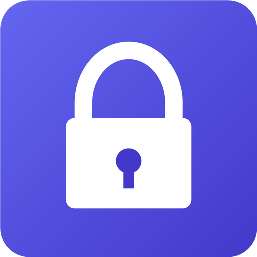
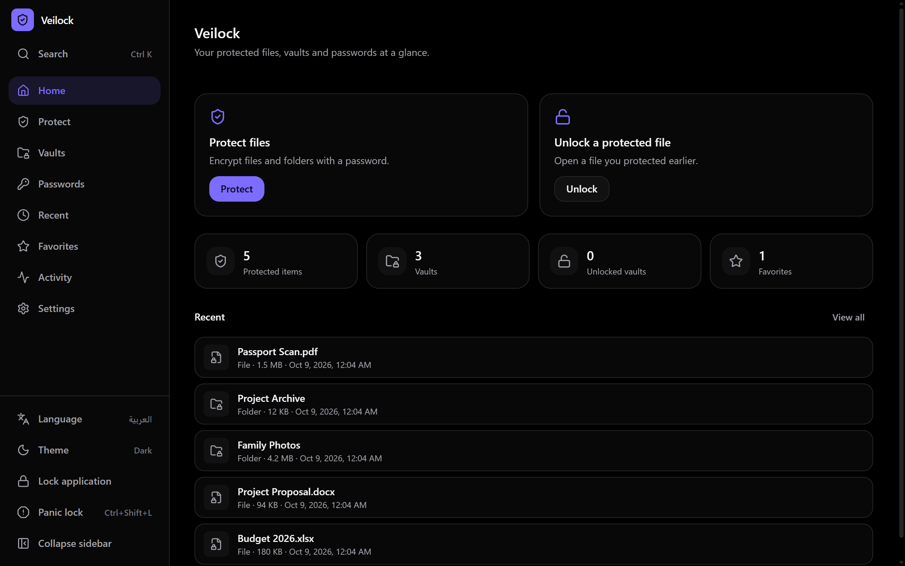
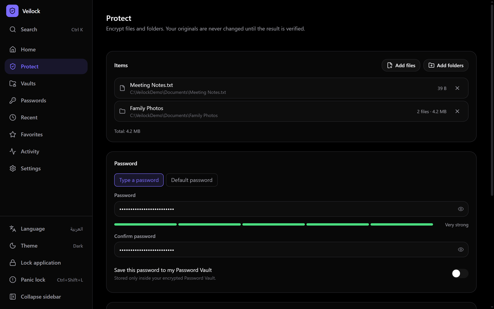
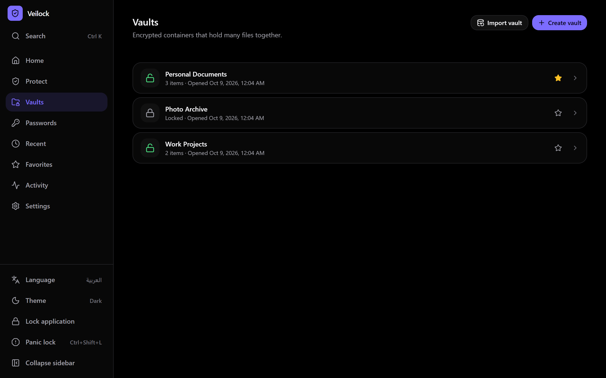
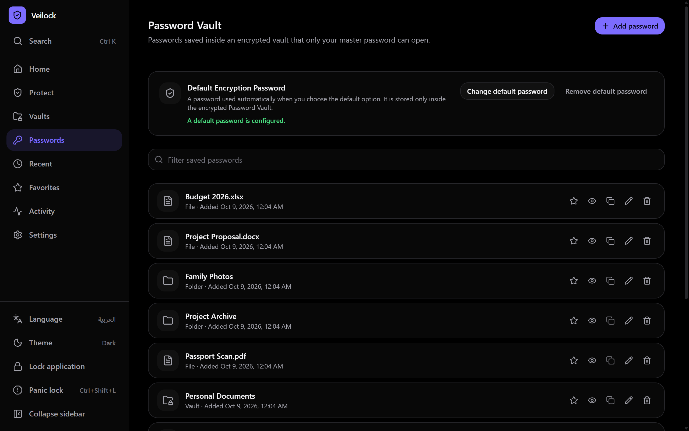
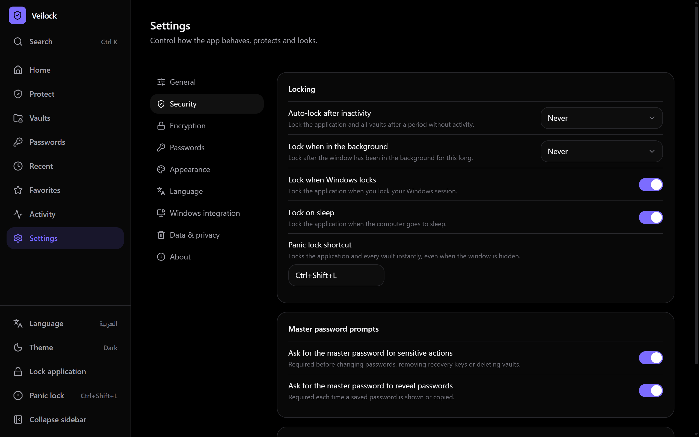
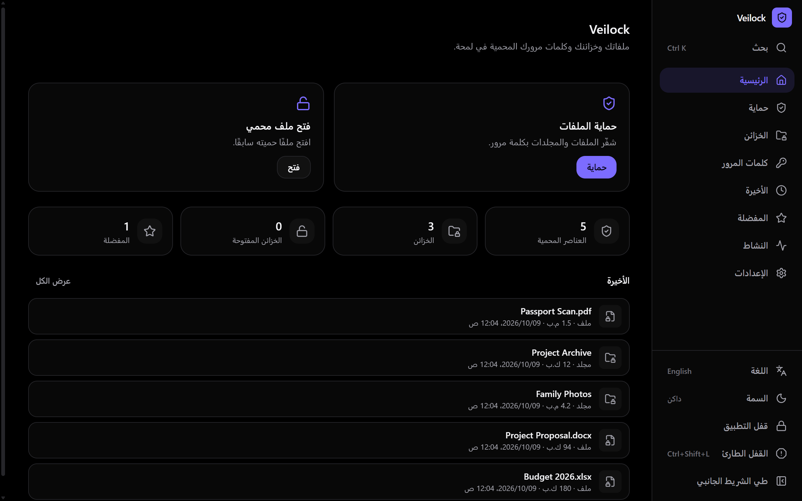
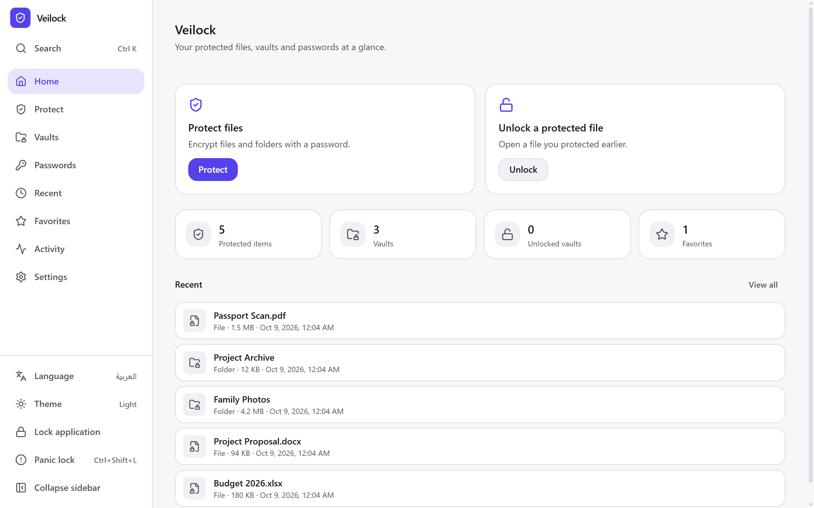
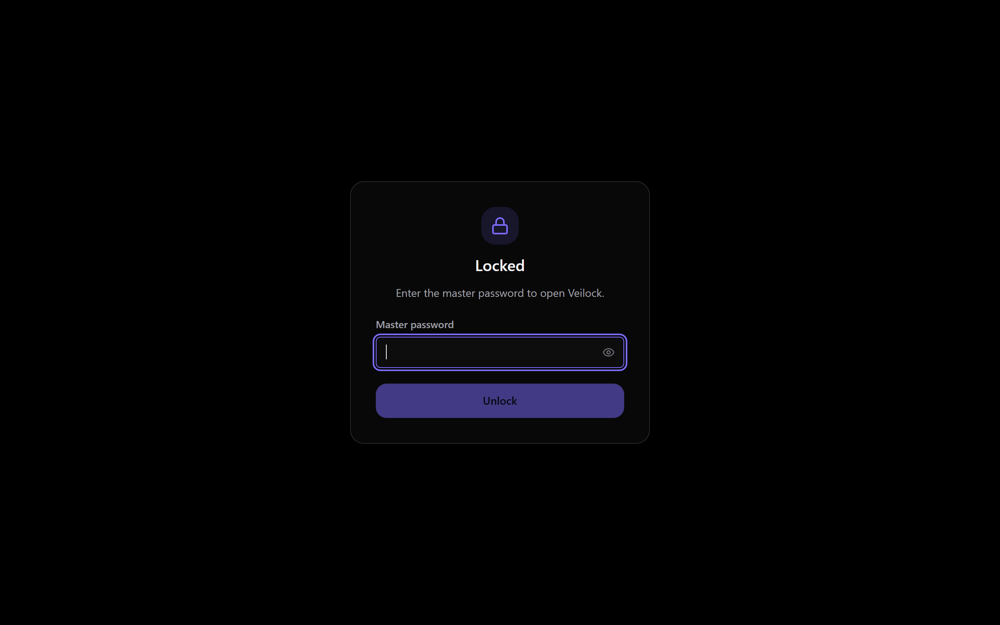
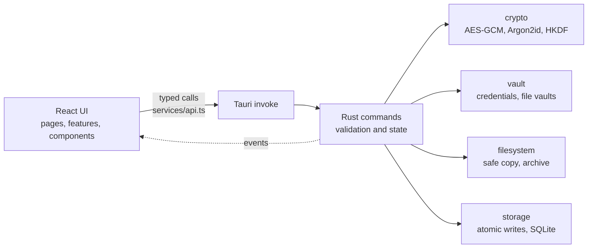

<div align="center">



# Veilock

**Protect your files with real encryption.**

A local-first Windows desktop app for encrypting files and folders, keeping saved passwords,
and organising everything into encrypted vaults. Offline by design: no account, no cloud,
no telemetry.

<br />


<br />



</div>

<br />

## Overview

Veilock encrypts files and folders on your own machine and produces a single `.veil` file that only
the right password (or recovery key) can open. Encryption and key handling happen in Rust; the
React interface never sees a key.

Everything stays on the device. The app makes no network requests, has no accounts and sends no
telemetry. You hold the keys, which also means there is no way for anyone, including the
developers, to recover a forgotten password for you.

## Highlights

| | |
|---|---|
| **Authenticated encryption** | AES-256-GCM in 1 MiB chunks, with a random key per file and Argon2id password hashing |
| **Files and folders** | Stream large files with real progress and safe cancellation; folders are packed and encrypted as one item |
| **Safe by default** | The original is never touched until the encrypted copy has been written and verified by decrypting it again |
| **Encrypted vaults** | Group many files under one vault password; import and export vaults as a single bundle |
| **Password Vault** | Saved file passwords live in a store protected by your Master Password and masked by default |
| **Auto-lock and Panic Lock** | Lock on inactivity, on minimise, on Windows lock or sleep, or instantly with `Ctrl+Shift+L` |
| **English and Arabic** | Full right-to-left layout, switchable at runtime |
| **Dark, Light, System** | Dark mode uses a true black `#000000` base |

## Screenshots

All screenshots are taken from the running application with throwaway demo data.

<table>
  <tr>
    <td align="center" width="50%">
      <br />
      <sub><b>Protect</b> &mdash; stage files and folders, set a password</sub>
    </td>
    <td align="center" width="50%">
      <br />
      <sub><b>Vaults</b> &mdash; encrypted containers that hold many files</sub>
    </td>
  </tr>
  <tr>
    <td align="center" width="50%">
      <br />
      <sub><b>Passwords</b> &mdash; the Master-Password-protected Password Vault</sub>
    </td>
    <td align="center" width="50%">
      <br />
      <sub><b>Settings</b> &mdash; locking, Panic Lock and password prompts</sub>
    </td>
  </tr>
  <tr>
    <td align="center" width="50%">
      <br />
      <sub><b>العربية</b> &mdash; full RTL layout</sub>
    </td>
    <td align="center" width="50%">
      <br />
      <sub><b>Light theme</b></sub>
    </td>
  </tr>
  <tr>
    <td align="center" colspan="2">
      <br />
      <sub><b>Lock screen</b> &mdash; the Master Password is required to open the app again</sub>
    </td>
  </tr>
</table>

## Features

**Encryption**

- Encrypt files and whole folders to `.veil` files, with progress and cancellation.
- Choose a typed password, or use the optional Default Encryption Password.
- Optional 256-bit recovery key per file, shown once and never stored by the app.
- Conflict handling when the output already exists: Replace, Keep both, or Cancel. Nothing is overwritten silently.
- Optionally remove the original after encrypting, only after the encrypted copy has been verified.
- Password generator and strength meter.

**Management**

- Home dashboard with protected-item counts and a recent list; Recent and Favorites pages.
- Rename, move, favorite, reveal in folder, change password, and add or remove a recovery key on protected items.
- Global search (`Ctrl+K`) over unlocked content metadata.
- Local activity log, which can be cleared or turned off.

**Security controls**

- App lock, auto-lock policies, and Panic Lock.
- Clipboard auto-clear after 10, 30 or 60 seconds (or never).
- Optional Master Password prompts before sensitive actions and before revealing a saved password.

**Windows integration** (all per-user, optional, and removable)

- `.veil` file association, so opening a file from Explorer goes to the unlock flow.
- Explorer context-menu entries and *Start with Windows*.
- Single-instance behaviour: opening files while Veilock is running hands them to the open window.

## Security

| Purpose | Implementation |
|---|---|
| File and folder encryption | AES-256-GCM, chunked (STREAM-style), 1 MiB chunks |
| Password to key | Argon2id, 64 MiB memory, 3 passes, 4 lanes, 16-byte random salt, NFKC-normalised input |
| Key separation | HKDF-SHA256 with distinct labels |
| Per-file key | Random 256-bit key per file; passwords and recovery keys only wrap it |
| Key slots | 4 slots per file: password and recovery key, each with a shadow slot |
| Randomness | Operating system CSPRNG |
| Memory hygiene | Secrets held in zeroizing buffers and wiped on drop |

The header is authenticated, so truncation, reordering, splicing, appending and tampering are
detected, and nothing partial is released on failure. A wrong password and a corrupted file are
reported as different outcomes.

The full model, including what Veilock does *not* protect against, is in
[docs/SECURITY.md](docs/SECURITY.md). The software has not had an independent security audit.

## Password Vault

Veilock can remember the passwords of your protected files so you do not have to retype them. They
are stored in a single encrypted credential store (`credentials.vlkc`), protected by your
**Master Password**.

- Passwords are masked by default. Revealing or copying one can require the Master Password
  (on by default, configurable).
- The Master Password is never stored. It is only used to derive the key of the credential store.
- The Master Password cannot be recovered. If you forget it, the saved passwords are lost; the
  encrypted files themselves can still be opened with their own passwords or recovery keys.
- Saving a password is an explicit choice on the Protect page ("Save this password to my Password
  Vault").

## Default Encryption Password

An optional password that Veilock can use whenever you do not want to type one. It is stored only
inside the encrypted credential store, never in plaintext and never in `settings.json`. Three modes:

| Mode | Behaviour |
|---|---|
| Automatic | Use the Default Encryption Password without asking |
| Ask each time | Prompt before using it |
| Require Master Password | Ask for the Master Password before using it |

## Encrypted Vaults

A vault is an encrypted container that holds many files under one password. Each item inside is its
own `.veil` container, so changing the vault password never re-encrypts your data.

| Action | Supported |
|---|---|
| Create, unlock, lock | Yes |
| Rename, favorite | Yes |
| Change password | Yes |
| Set or remove a recovery key | Yes |
| Add files, extract an item, remove an item | Yes |
| Export to a `.veilvault` bundle, import a bundle | Yes |
| Delete a vault | Yes |

Locked vault contents are never included in global search.

## Arabic and English

The interface ships in English (left-to-right) and Arabic (right-to-left). The language can be
switched while the app is running; layout mirrors using logical properties and the document
direction updates immediately. Both languages use the same translation keys, and a test enforces
that.

## Themes

Dark, Light and System. The Dark theme is built on true black (`#000000`). The sidebar's theme
button cycles through the three.

## Technology

| Layer | Stack |
|---|---|
| Shell | [Tauri 2](https://tauri.app) (dialog, global-shortcut and single-instance plugins) |
| Backend | Rust 2021 edition (MSRV 1.77) |
| Cryptography | `aes-gcm`, `argon2`, `hkdf`, `sha2`, `rand`, `subtle`, `zeroize`, `secrecy` |
| Storage | `rusqlite` (bundled SQLite) for metadata; encrypted files for secrets |
| Windows | `winreg`, `windows-sys` |
| Frontend | React 18, TypeScript (strict), Vite 6 |
| Styling and state | Tailwind CSS 3, Zustand 5, lucide-react |
| Tests | `cargo test`, Vitest 3 with Testing Library |

## Architecture



`src/services/api.ts` is the only module that calls `invoke`. Commands stay thin, long operations
run on worker threads and report real byte counts, and the lock state machine is owned by Rust.
More detail is in [docs/ARCHITECTURE.md](docs/ARCHITECTURE.md).

## Installation

Veilock does not have published releases yet, so the installer is built from source (see
[Building](#building)). `npm run tauri build` produces a per-user NSIS installer, which does not
need administrator rights and registers the `.veil` file association.

Uninstalling removes only the application and its own registry entries. It never deletes your
`.veil` files.

## Development

**Prerequisites**

- Windows 10 or 11 with the Microsoft Edge WebView2 runtime
- [Node.js](https://nodejs.org) 20 (developed with v20.20)
- [Rust](https://rustup.rs) 1.77 or newer (developed with 1.97) and the MSVC build tools
- The [Tauri 2 prerequisites for Windows](https://tauri.app/start/prerequisites/)

```bash
npm install
npm run tauri dev
```

| Command | What it does |
|---|---|
| `npm run dev` | Vite dev server for the UI only |
| `npm run tauri dev` | Full desktop app with hot reload |
| `npm run typecheck` | TypeScript check (`tsc --noEmit`) |
| `npm test` | Frontend tests (Vitest) |
| `npm run build` | Type-check and build the frontend |
| `npm run tauri build` | Build the release app and the installer |

## Building

```bash
npm run tauri build
```

Output, relative to the repository root:

| Artifact | Path |
|---|---|
| Application | `src-tauri/target/release/veilock.exe` |
| Installer | `src-tauri/target/release/bundle/nsis/Veilock_0.1.0_x64-setup.exe` |

The release profile enables LTO, `panic = abort` and symbol stripping.

## Testing

```bash
npm test                      # frontend: 31 tests
cd src-tauri && cargo test    # Rust: 203 tests
```

Both suites passed on 2026-10-09 (`npm test`: 6 files, 31 tests; `cargo test`: 203 tests, 0 failed).

The Rust suite covers container round-trips, wrong passwords, tamper, truncation and reordering
detection, hostile headers, recovery keys, the credential store, vaults and bundle import,
archive extraction safety, conflict policies, cancellation and lock policy. The frontend suite
covers translation completeness and RTL, shortcut parsing, error mapping, id generation, toasts and theme resolution. Tests only
use temporary data.

## Privacy

- No network requests, accounts, analytics or telemetry. The webview runs under a strict
  local-only Content Security Policy.
- Passwords, keys and decrypted content are never written to logs, `settings.json`,
  `localStorage` or `sessionStorage`.
- Data lives under `%APPDATA%\app.veilock.desktop` (settings, encrypted credential store, vaults,
  and a SQLite database of item names, paths, sizes and the activity log). File names are
  metadata and are not secret key material; the activity log can be turned off or cleared in
  Settings.

## Encrypted file format

A `.veil` file is a clear 48-byte header, four fixed-size key slots, an encrypted metadata block
(which holds the original name), and AES-256-GCM data chunks. Because the header hash is part of
every authentication tag, any change to it invalidates the file. The byte-level layout, including
vault and bundle formats, is specified in [docs/FORMAT.md](docs/FORMAT.md).

## Project structure

```text
.
├── branding.json        app name, identifier, extensions, default shortcut
├── docs/                SECURITY, FORMAT, ARCHITECTURE, screenshots
├── src/                 React + TypeScript frontend
│   ├── pages/           Home, Protect, Vaults, Passwords, Settings, ...
│   ├── features/        encryption, decryption, vaults, lock, settings, search
│   ├── services/        typed IPC wrapper (api.ts)
│   ├── i18n/            English and Arabic locales
│   └── stores/          Zustand stores
└── src-tauri/           Rust backend and Tauri configuration
    └── src/
        ├── commands/    IPC command handlers
        ├── crypto/      container, key slots, KDF, streaming AEAD, recovery
        ├── vault/       credential store and file vaults
        ├── filesystem/  safe operations and folder archives
        ├── security/    clipboard, generator, strength meter
        ├── storage/     atomic writes, SQLite metadata
        ├── settings/    validated settings
        ├── history/     activity log
        └── integration/ HKCU registry, global shortcut, session events
```

## Limitations

- Windows only for now. The code and installer target Windows 10 and 11.
- Removing an original is a normal file delete. On SSDs, and with journaling, shadow copies,
  backups or cloud sync, plaintext copies may remain recoverable. Veilock does not claim
  guaranteed secure deletion.
- A forgotten Master Password, file password or recovery key cannot be recovered.
- Encryption cannot help against malware running as your user while the app is unlocked, or
  against weak passwords.
- The encrypted file's name, size and timestamps are visible outside the container.
- No independent security audit has been performed.

## Roadmap

- Published, signed releases
- Continuous integration for the test suites
- Additional platforms beyond Windows
- An independent security review

## Contributing

Issues and pull requests are welcome. Before opening a pull request, run `npm run typecheck`,
`npm test` and `cargo test`, and keep security-sensitive logic in Rust. Please report suspected
vulnerabilities privately rather than in a public issue, as described in
[docs/SECURITY.md](docs/SECURITY.md#8-reporting-issues), and never attach real encrypted files or
passwords.

## License

No license file is included in this repository yet, so no license is granted. Add a `LICENSE`
before redistributing or accepting outside contributions.
